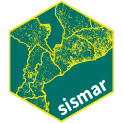

# sismar-shiny 

Arrumar dados do MISAU através de um aplicativo web

<!-- badges: start -->

<!-- badges: end -->

## Resumo

O pacote `sismar` foi criado para arrumar dados dos sistemas de informação do MISAU, reduzindo assim barreiras à análise.  Esta aplicativo [`sismar` Shiny](https://josephlara-sismar-shiny.share.connect.posit.cloud/) fornece acesso através da web à funcionalidade sismar sem qualquer instalação de software.

---

*Disclaimer: The findings, interpretation, and conclusions expressed herein are those of the authors and do not necessarily reflect the views of United States Agency for International Development. All errors remain our own.*